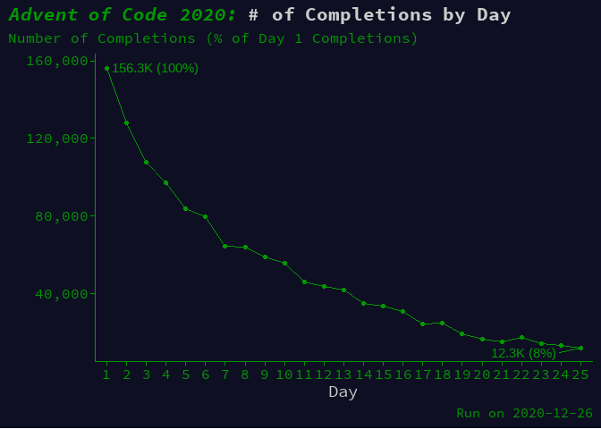
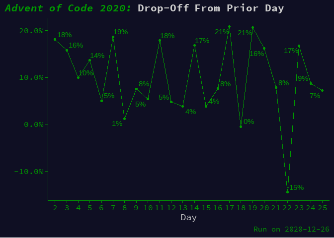
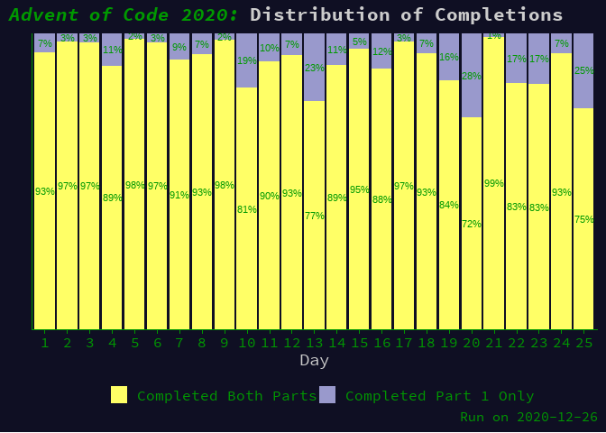

advent-of-code-2020
================

My submissions for the [2020 Advent of Code
Contest](https://adventofcode.com/). I’ve been doing the contest in the
R language.

## Some AoC 2020 Stats

<!-- --><!-- --><!-- -->
